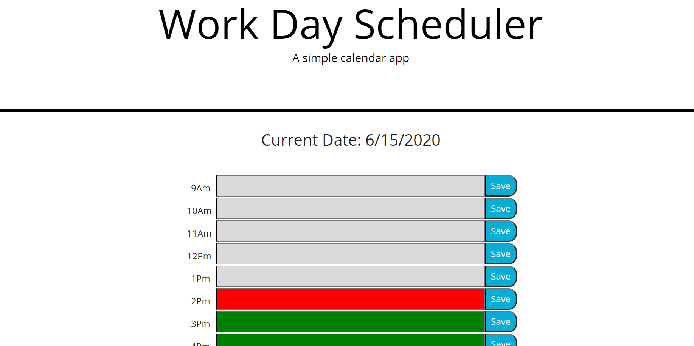

# gt-dayplanner-hw5
## Description

Homework assignment for students to design a day planer with color changing text boxes as time passes.

## Table of contents

* [Create](#create)
* [Usage](#usage)
* [Credits](#credits)
* [License](#license)

## create

1. Create an HTML page
2. Use javascript, Jquery and CSS to design the planner
3. Pull current date and time. Show the date
4. Have the text box change color as the time of day equals it and passes it
5. Be able to enter things and save it to local in al the text boxes
6. Text enetered stays even during page refresh

## Usage

[Deployed Website](https://lead81.github.io/gt-dayplanner-hw5/)

## Credits

Google.com
The GT coding boot camp team/activities.
W3Schools.com
Tutors

## License

Permission is hereby granted, free of charge, to any person obtaining a copy of this software and associated documentation files (the "Software"), to deal in the Software without restriction, including without limitation the rights to use, copy, modify, merge, publish, distribute, sublicense, and/or sell copies of the Software, and to permit persons to whom the Software is furnished to do so, subject to the following conditions:

The above copyright notice and this permission notice shall be included in all copies or substantial portions of the Software.

THE SOFTWARE IS PROVIDED "AS IS", WITHOUT WARRANTY OF ANY KIND, EXPRESS OR IMPLIED, INCLUDING BUT NOT LIMITED TO THE WARRANTIES OF MERCHANTABILITY, FITNESS FOR A PARTICULAR PURPOSE AND NONINFRINGEMENT. IN NO EVENT SHALL THE AUTHORS OR COPYRIGHT HOLDERS BE LIABLE FOR ANY CLAIM, DAMAGES OR OTHER LIABILITY, WHETHER IN AN ACTION OF CONTRACT, TORT OR OTHERWISE, ARISING FROM, OUT OF OR IN CONNECTION WITH THE SOFTWARE OR THE USE OR OTHER DEALINGS IN THE SOFTWARE.